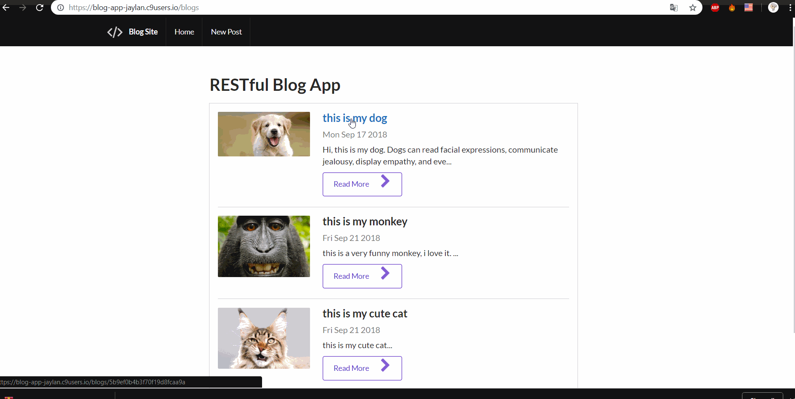

# Pre-work - *blog-app*

**blog-app** is a web application using html, css, javascript, mongo, jquery, sementic UI and express.js.

Submitted by: **Jie Lan**

Time spent: **20** hours spent in total

## User Stories

The following **required** functionality is complete:

* List all posted information on the home page.
* User can add new post by click new post(information including image, tilte and description).
* User can edit the previous post.
* User can delete the previous post.
* Use semantic UI to improve the page design.
* Use express.js to build up the server.
* Use mongo to set up the database.

## Video Walkthrough 

Here's a walkthrough of implemented user stories:

GIF created with [LiceCap](http://www.cockos.com/licecap/).

## License

    Copyright [Jie Lan] [name of copyright owner]

    Licensed under the Apache License, Version 2.0 (the "License");
    you may not use this file except in compliance with the License.
    You may obtain a copy of the License at

        http://www.apache.org/licenses/LICENSE-2.0

    Unless required by applicable law or agreed to in writing, software
    distributed under the License is distributed on an "AS IS" BASIS,
    WITHOUT WARRANTIES OR CONDITIONS OF ANY KIND, either express or implied.
    See the License for the specific language governing permissions and
    limitations under the License.
